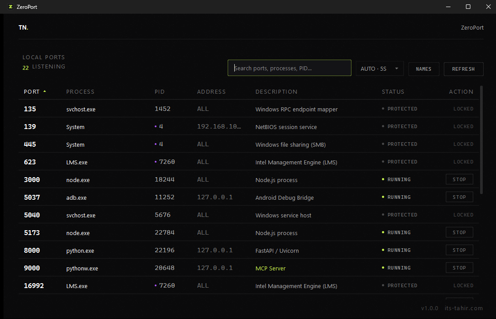

<div align="center">

# ZeroPort

### What is using port 8000?

ZeroPort answers that in the time it takes to double-click a shortcut —
and lets you release the port safely.

<br>

[](https://github.com/its-tahir/zero-port/releases/latest/download/ZeroPort.exe)

**No installer · No Python · No admin rights · 100% offline**

<br>

[](https://github.com/its-tahir/zero-port/releases/latest)
[](https://github.com/its-tahir/zero-port/releases)
[](https://github.com/its-tahir/zero-port/actions/workflows/tests.yml)


<br>



</div>

---

## The problem

You start a service and get this:

```text
OSError: [Errno 10048] error while attempting to bind on address
('127.0.0.1', 8000): only one usage of each socket address is
normally permitted
```

So you open a terminal, run `netstat -ano | findstr :8000`, copy the PID,
run `tasklist /fi "pid eq 12452"`, and end up looking at `python.exe` —
which tells you nothing, because you have four of those running.

ZeroPort is that whole loop, as one window.

It is a single-window Windows desktop utility that lists every listening TCP
port on your machine, names the process behind it, works out what that process
probably *is*, and gives you one deliberate way to stop it.

That is the whole product. It is not a task manager, a system monitor, or a
network analyser, and it will not grow into one.

---

## Install

**[⬇ Download ZeroPort.exe](https://github.com/its-tahir/zero-port/releases/latest/download/ZeroPort.exe)** — one file, 34 MB, nothing to install.

1. Download it.
2. Double-click it. Right-click → *Send to → Desktop* if you want a shortcut.

Windows SmartScreen shows a warning the first time ("Windows protected your
PC"), because the binary is not code-signed. Choose **More info → Run anyway**.

If you would rather verify before running, every release publishes the
executable's SHA-256:

```powershell
Get-FileHash ZeroPort.exe -Algorithm SHA256
```

Prefer to build it yourself from source? See
[Building ZeroPort.exe](#building-zeroportexe).

---

## Features

- **Real listening TCP ports**, read straight from the Windows connection
  table — never sample data.
- **Process identity**: name, PID, executable path, command line, owner.
- **Descriptions that use evidence.** `python -m uvicorn main:app` becomes
  *FastAPI / Uvicorn*; `next dev` becomes *Next.js*. A port number alone is
  treated as weak evidence, so a bare `python.exe` on 5432 stays
  *Python process* instead of pretending to be PostgreSQL.
- **Your own names.** Map `8000 → AI Backend` and it overrides everything else.
- **Instant search** across port, process, PID, address and description.
- **Manual refresh and auto-refresh** (2 / 5 / 10 / 30 seconds, or off;
  5 seconds by default).
- **Safe termination**: confirm, revalidate the process identity, terminate
  gracefully, escalate only if needed, then rescan.
- **System-process protection.** Windows core processes show `PROTECTED` and
  have no stop action.
- **Multiple ports per process** are shown accurately, with a violet marker on
  the PID and the full port list in the confirmation dialog.
- Works entirely offline. No account, no telemetry, no network calls.

---

## Tech stack

| Piece | Choice | Why |
|---|---|---|
| UI | PySide6 (Qt Widgets) | Native window, no browser, fast start |
| System access | psutil | One well-tested API for sockets and processes |
| Packaging | PyInstaller | Single `.exe`, no Python needed on the target machine |

`PySide6-Essentials` is used rather than the full `PySide6` meta-package: the
app only needs QtCore, QtGui and QtWidgets, and the extra ~140 MB would
otherwise end up inside the executable.

---

## Development setup

```bat
python -m venv .venv
.venv\Scripts\activate
pip install -r requirements-dev.txt
```

Run it:

```bat
python -m app.main
```

Requires Python 3.11 or newer on Windows 10/11.

---

## Testing

```bat
python -m pytest
```

The suite runs against the real operating system rather than mocks: it binds
actual sockets and checks they appear, spawns real child processes and stops
them, and forces the awkward paths — a PID that exits first, a PID reused by
another process, an access-denied terminate, a process that ignores
`terminate()`, a config file with a typo in it.

`tests/test_end_to_end.py` drives the whole product once: it starts a real
listener, waits for the real window to show it, clicks the STOP cell through
Qt's event system, accepts the confirmation dialog, and checks the port is
released and the row disappears on its own. The UI tests run headless under
Qt's offscreen platform, so no desktop session is needed.

---

## Building `ZeroPort.exe`

```bat
build_windows.bat
```

The script creates the virtual environment if needed, installs dependencies,
generates the icon, runs the tests, and only then packages. Use
`build_windows.bat --no-tests` to skip the test run.

Result:

```
dist\ZeroPort.exe
```

It is a single windowed executable — no console window appears — and runs on a
Windows machine with no Python installed. Right-click it and *Send to →
Desktop* to make a shortcut.

To rebuild the icon by itself:

```bat
python tools\make_icon.py
```

### Publishing a release

Tagging a commit builds the executable in GitHub Actions and attaches it to a
release, so the published binary is always reproducible from tagged source:

```bat
git tag v1.0.0
git push origin v1.0.0
```

The workflow is [.github/workflows/release.yml](.github/workflows/release.yml).
It installs dependencies, generates the icon, runs the full test suite, builds,
and publishes only if all of that passes.

---

## Configuration

Settings live in a single file:

```
%APPDATA%\ZeroPort\config.json
```

```json
{
  "auto_refresh": true,
  "refresh_interval": 5,
  "window": { "width": 1100, "height": 700, "maximized": false },
  "custom_descriptions": {
    "8000": "AI Backend",
    "3000": "Frontend",
    "9000": "MCP Server"
  }
}
```

Edit it by hand, or use the **NAMES** button in the app. Custom descriptions
override automatic inference and are shown in lime so you can tell them apart.

A malformed config never blocks startup. Individual invalid values fall back to
the defaults and the rest of the file is still used. If the file cannot be
parsed at all, it is kept as `config.invalid.json` rather than overwritten, so
a stray comma never costs you your port names.

---

## Administrator permissions

ZeroPort deliberately does **not** require elevation.

Without it you can see every listening port on the machine and stop anything
you own — which covers essentially all development servers. Processes owned by
`SYSTEM` cannot be inspected in full or terminated; ZeroPort says so plainly
rather than failing silently, and suggests running as Administrator when that
is the actual blocker.

The app never elevates itself and never runs shell commands.

---

## Keyboard

| Key | Action |
|---|---|
| `F5` / `Ctrl` + `R` | Refresh |
| `Ctrl` + `F` | Focus search |
| `Esc` | Clear search |
| `Enter` / double-click | Process details |
| Right-click | Details, copy port, copy PID, stop |

---

## Known limitations

- **Windows only.** The protection rules, address formatting and packaging are
  written for Windows 10/11. The service layer would mostly work elsewhere; the
  judgement about what is safe to kill would not.
- **Listening TCP only.** UDP endpoints and established connections are out of
  scope by design — they are not what "port already in use" means.
- **Some sockets have no visible owner.** Windows hides the owning PID of a few
  system sockets. Those rows appear with `UNKNOWN` status and no stop action.
- **Descriptions are inferences.** They are drawn from the command line and
  executable name, and they stay vague when the evidence is weak. If ZeroPort
  says *Python process*, that is the honest answer, not a failure.
- **No stop-all.** Releasing ports is intentionally one decision at a time.

---

Built by Tahir Nazir — [its-tahir.com](https://its-tahir.com)
